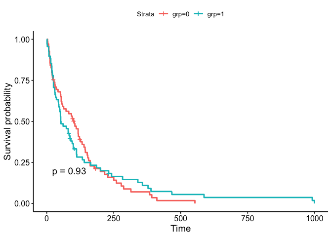
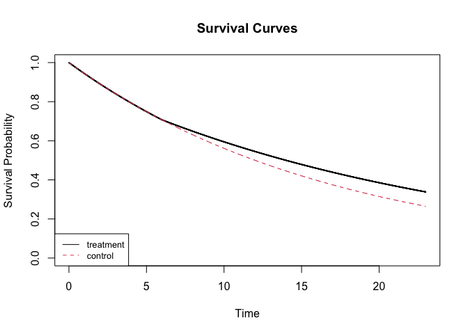

<!-- README.md is generated from README.Rmd. Please edit that file -->

# package: maxLRT

<!-- badges: start -->

<!-- badges: end -->

Package: maxLRT provides functions to perform combination test including
maximum weighted logrank test (MWLR) and projection test, to calculate
sample size with MWLR in a simulation-free approach allowing for
staggered entry, drop-out etc, to visualize the design parameters and to
simulate survival data with flexible design input.

## Installation

You can install the released version of maxLRT from
[CRAN](https://CRAN.R-project.org) with:

``` r
#install.packages("maxLRT")
```

And the development version from [GitHub](https://github.com/) with:

``` r
# install.packages("devtools")
#devtools::install_github("hcheng99/maxLRT")
```

## Example 1 - perform maximum weighted logrank test

This is a basic example which shows you how to perform maximum weighted
logrank test.

``` r
library(maxLRT)

## load data from the package and only keep variables used.
tmpd <- with(maxLRT::lung, data.frame(time=SurvTime,stat=1-censor,grp=Treatment))

# plot the KM curve
library(survminer)
#> Loading required package: ggplot2
#> Loading required package: ggpubr
library(survival)
#> 
#> Attaching package: 'survival'
#> The following object is masked from 'package:maxLRT':
#> 
#>     lung
fit <- survfit(Surv(time,stat)~grp,data=tmpd)
ggsurvplot(fit,data=tmpd, pval = TRUE)
```



``` r
################ Maxcombo test ###################
#### generate the weight functions 
wt1 <- gen.wgt(method="Maxcombo")

t1 <- MaxLRtest(tmpd
                        ,Wlist=wt1
                        ,base=c("KM")
                        ,alpha=0.05
                        ,alternative=c("two.sided")
)
t1$stat ;t1$p.value
#> [1] 0.933386
#> [1] 0.587945
############# test proposed by Cheng and He (2021)############
#### generate the weight functions 
wt2 <- gen.wgt(method="Maxcross",theta=0.5)
t2 <- MaxLRtest(tmpd
                        ,Wlist=wt2
                        ,base=c("KM")
                        ,alpha=0.05
                        ,alternative=c("two.sided")
)
t2$stat ;t2$p.value
#> [1] 1.870191
#> [1] 0.1527593

#### plot the weight functions
plot(t2)
```

 In the above
example, the two survival curves cross over. Cheng’s method has the
smallest p-value among logrank and Maxcombo test, showing the power
advantage in detecting crossing hazards.

## Example 2 sample size calculation

### case 1: exponential control group with proportional hazards

#### uniform enrollment

Three commonly used methods based on logrank test under proportional
hazards The parameters are taken from an example from paper - Lu (2021)

``` r
t_enrl <- 5
t_fup <- 5
lmd0 <- -log(0.2)/10
f_hr <- function(x){0.5*x^0}
ss <- 1
ratio <-1 
alpha <- 0.05
beta <- 0.1
timef1 <- gen.wgt(method="LR")
########with uniform enrollment
ef <- function(x){(1/t_enrl)*(x>0&x<=t_enrl)}

#########Lakatos Method############### 
size1 <- pwr2n.maxLR(entry     = t_enrl
            ,fup      = t_fup
            ,k        = 100
            ,ratio    = ratio
            ,Wlist  = timef1
            ,CtrlHaz=function(x){lmd0*x^0}
            ,transP1=c(0,0)
            ,transP0=c(0,0)
            ,hazR     = f_hr
            ,alpha    = alpha
            ,beta     = beta
            ,entry_pdf0=ef
            ,entry_pdf1 =ef
)
c(size1$totalN,size1$eventN)
#> [1] 155.69812  88.94697
target_N <- round(size1$totalN,digits=0)
target_E <- round(size1$eventN,digits=0)
c(target_E,target_N)
#> [1]  89 156
#########schoenfeld's formula############### 
# a very large scale parameter for drop-out achieves the effect 
# that no one will drop out.
size1_s <- pwr2n.LR(method = "schoenfeld"
                    ,lambda0 = lmd0
                    ,lambda1 = lmd0*0.5
                    ,ratio = ratio
                    ,entry = t_fup
                    ,fup = t_fup
                    ,alpha = alpha
                    ,beta  = beta
                    ,Lparam = c(1,100000000))

c(size1_s$eventN, size1_s$totalN)
#> [1]  87.4793 153.1734
#########Freedman's formula############### 
size1_f <- pwr2n.LR(method = "freedman"
                    ,lambda0 = lmd0
                    ,lambda1 = lmd0*0.5
                    ,ratio = ratio
                    ,entry = t_fup
                    ,fup = t_fup
                    ,alpha = alpha
                    ,beta  = beta
                    ,Lparam = c(1,100000000))

c(size1_f$eventN, size1_f$totalN)
#> [1]  94.56681 165.58336
```

### case 2: exponential control group with delayed treatment effects

``` r
t_enry <- 12  ## entry time 
t_fup <- 18   ## follow-up time 
lmd0 <- log(2)/12 # hazard ratio for control group
ratio <- 1 # allocation ratio
f_hr_delay <- function(x){(x<=6)+(x>6)*0.75} # hazard ratio #function

##################Maxcombo test ###################
size2_m <- maxLRT::pwr2n.maxLR(entry     = t_enrl
            ,fup      = t_fup
            ,k        = 100
            ,ratio    = ratio
            ,Wlist  = wt1
            ,CtrlHaz=function(x){lmd0*x^0}
            ,transP1=c(0,0)
            ,transP0=c(0,0)
            ,hazR     = f_hr_delay
            ,alpha    = alpha
            ,beta     = beta
  
            
)
target_N <- round(size2_m$totalN,digits=0)
target_E <- round(size2_m$eventN,digits=0)
c(target_E,target_N)
#> [1] 1190 1809
#### plot the survival curve based on input design parameters 
plot(size2_m,type="survival")
```



``` r

################logrank test ########################
size2_l <- maxLRT::pwr2n.maxLR(entry     = t_enrl
            ,fup      = t_fup
            ,k        = 100
            ,ratio    = ratio
            ,Wlist  = timef1
            ,CtrlHaz=function(x){lmd0*x^0}
            ,transP1=c(0.00,0)
            ,transP0=c(0.00,0)
            ,hazR     = f_hr_delay
            ,alpha    = alpha
            ,beta     = beta
  
            
)
target_N <- round(size2_l$totalN,digits=0)
target_E <- round(size2_l$eventN,digits=0)
c(target_E,target_N)
#> [1] 1664 2531
```

### References

Cheng,H.and He,J.(2021)A maximum weighted logrank test in detecting
crossing hazards.

Lu, K. (2021). Sample size calculation for logrank test and prediction
of number of events over time. Pharmaceutical Statistics, 20(2),
229-244.
